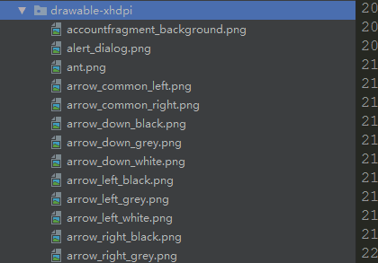

# IconViewer - Intellij Plugin

Preview project images as an icon in your project explorer. 
Helpful if you have a lot of icons in your project, IconViewer gives you a nice preview icon. 

Bigger images are scaled to 16x16, supported are:

 - *.gif
 - *.png 
 - *.bmp
 - *.jpg
 - *.jpeg
 - *.wbmp
 - *.bmp
 - *.svg
 - *.webp (Android Studio only)

## Demonstration

### Use before

You need to open them one by one to find out what they are.

### After use

Preview the content directly,*bravo* 

### Install

you can [download the enhanced version](https://github.com/longforus/IconViewer/releases)  and install it manually in:
`Preferences/Settings->Plugins->Install plugin from disk`